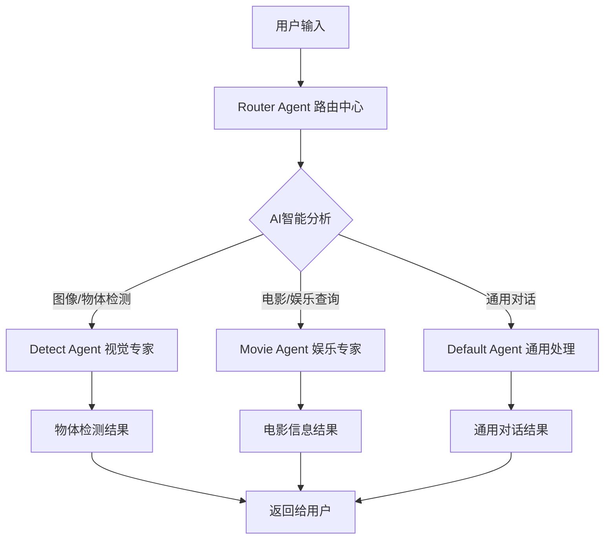

# A2A 智能路由代理系统

基于 Firebase Genkit 和 DeepSeek AI 的智能多代理路由系统，支持流式响应、物体检测和电影查询等专业服务。

## 🌟 系统概述

A2A (Agent-to-Agent) 智能路由系统是一个现代化的多代理协作平台，能够：

- 🧠 **AI 智能路由**: 基于 DeepSeek AI 模型进行智能代理选择
- 📋 **AgentCard 驱动**: 动态获取代理能力信息，精准匹配用户需求
- 🖼️ **多模态支持**: 支持文本、图像等多种输入模式
- ⚡ **流式处理**: 实时响应，优秀的用户体验
- 🛡️ **高可靠性**: 智能兜底机制，确保服务 100%可用

### 系统架构



## 🚀 核心特性

### AI 驱动的智能路由

- **🧠 深度语义理解**: 使用 DeepSeek AI 模型基于真实代理能力进行智能匹配
- **📋 AgentCard 驱动**: 基于代理的实际技能、描述、输入模式进行决策
- **🔍 上下文感知**: 自动分析用户输入的文本和图像信息
- **🎯 直接决策**: AI 直接输出最佳代理选择，无需复杂后备机制
- **🛡️ 兜底策略**: 未命中特定代理时自动使用通用代理确保服务可用

### 简化架构优势

- **🏗️ 架构简洁**: 单一 AI 决策点，逻辑清晰易维护
- **⚡ 响应快速**: 减少多层分析步骤，提升路由决策速度
- **📈 易于扩展**: 新增代理只需更新 AgentCard 信息即可
- **🔧 配置灵活**: 通过修改 AI 提示词即可调整路由逻辑
- **✅ 可靠性高**: 预构建客户端连接，减少运行时错误

### 专业代理服务

- **🎬 电影助手**: 电影推荐、演员信息、剧情查询
- **📷 物体检测专家**: 图像分析、物体识别、边界框标注
- **🔄 智能路由中心**: 分析用户需求，智能分发到最佳代理

## 📦 前置要求

- Node.js 18+
- npm、yarn 或 pnpm
- DeepSeek API 密钥 ([获取地址](https://platform.deepseek.com/api_keys))
- TMDB API 密钥 ([获取地址](https://www.themoviedb.org/settings/api)) - 仅电影代理需要

## 🛠️ 快速开始

### 1. 环境准备

```bash
# 导航到项目目录
cd example/a2a

# 安装依赖
npm install

# 配置环境变量
cp .env.example .env
```

在 `.env` 文件中配置 API 密钥：

```env
DEEPSEEK_API_KEY=your_deepseek_api_key_here
TMDB_API_KEY=your_tmdb_api_key_here
```

### 2. 启动系统

**方法一：完整系统启动**

```bash
# 终端1: 启动电影代理
npm run start:movie-agent

# 终端2: 启动物体检测代理
npm run start:detect-agent

# 终端3: 启动智能路由代理
npm run start:router-agent
```

**方法二：单独启动路由代理（推荐）**

```bash
# 智能路由代理会自动管理其他代理
npm run start:router-agent
```

### 3. 使用客户端

```bash
# 连接到智能路由系统
npm run start:cli http://localhost:41240
```

### 4. 测试系统

```bash
# 运行AI路由决策测试
npm run test:router
```

## 💡 使用示例

### 物体检测场景

```
You: 请帮我分析这张照片中有什么物体

🧠 开始AI智能路由分析
📝 用户输入: "请帮我分析这张照片中有什么物体"
🖼️ 包含图像: true
📋 可用代理: 2 个
🎯 AI分析结果: "DETECT_AGENT"
✅ 路由到物体检测代理

[物体检测代理响应]
🔍 图像分析完成！检测到 3 个物体：

检测摘要：
- person: 2 个
- car: 1 个

详细检测结果：
1. person (置信度: 92.5%)
   位置: (120, 80) 到 (180, 200)
2. person (置信度: 88.3%)
   位置: (300, 90) 到 (360, 210)
3. car (置信度: 95.1%)
   位置: (450, 150) 到 (650, 300)
```

### 电影查询场景

```
You: 推荐几部汤姆·汉克斯的经典电影

🧠 开始AI智能路由分析
📝 用户输入: "推荐几部汤姆·汉克斯的经典电影"
🖼️ 包含图像: false
🎯 AI分析结果: "MOVIE_AGENT"
✅ 路由到电影代理

[电影代理响应]
🎬 以下是汤姆·汉克斯的经典电影推荐：

1. 《阿甘正传》(1994)
   - 评分：8.8/10
   - 简介：一个智力有缺陷但内心纯真的男子的传奇人生...

2. 《拯救大兵瑞恩》(1998)
   - 评分：8.6/10
   - 简介：二战期间营救士兵的感人故事...

3. 《荒岛余生》(2000)
   - 评分：7.8/10
   - 简介：一个人在荒岛上的生存故事...
```

### 通用对话场景

```
You: 你好，今天天气怎么样？

🧠 开始AI智能路由分析
📝 用户输入: "你好，今天天气怎么样？"
🎯 AI分析结果: "DEFAULT"
🎭 未命中特定代理，使用通用代理

[通用代理响应]
👋 您好！我是智能助手。不过我目前无法获取实时天气信息。

我可以为您提供以下服务：
- 🎬 电影推荐和查询
- 📷 图像分析和物体检测
- 💬 一般对话交流

有什么我可以帮助您的吗？
```

## 🔧 系统配置

### 代理端口配置

| 代理         | 端口  | 功能         |
| ------------ | ----- | ------------ |
| Router Agent | 41240 | 智能路由中心 |
| Movie Agent  | 41241 | 电影查询专家 |
| Detect Agent | 41242 | 物体检测专家 |

### 路由配置

在 `src/router-agent/index.ts` 中配置代理地址：

```typescript
const AGENTS = {
  DETECT_AGENT: {
    url: "http://localhost:41242",
    name: "物体检测代理",
  },
  MOVIE_AGENT: {
    url: "http://localhost:41241",
    name: "电影代理",
  },
};
```

### AI 提示词配置

在 `src/router-agent/router.prompt` 中自定义路由逻辑：

```handlebars
## 核心任务 基于用户输入和代理能力信息，选择最匹配的代理来处理用户请求。 ##
输出要求 - **代理名称** (如: DETECT_AGENT, MOVIE_AGENT) - 高度匹配时 -
**DEFAULT** - 无明确匹配时使用通用代理
```

## 📚 API 参考

### Router Agent 端点

- **基础 URL**: `http://localhost:41240`
- **代理卡片**: `http://localhost:41240/.well-known/agent.json`
- **消息发送**: `POST /send-message`

### 支持的输入类型

- **文本消息**: 普通文本查询
- **图像数据**: base64 编码的图像数据
- **文件上传**: 图像文件

### 响应格式

所有响应都遵循 A2A 协议的标准格式，包括：

- 任务状态更新
- 流式消息
- 错误处理

## 🔍 路由决策逻辑

### 简化决策架构

```
用户输入 + 代理信息 → AI智能分析 → 直接路由决策
        ↓                  ↓              ↓
     上下文信息        基于能力匹配      精准路由/通用代理
```

### 决策示例

| 用户输入                         | 图像 | AI 分析      | 路由决策         | 原因                          |
| -------------------------------- | ---- | ------------ | ---------------- | ----------------------------- |
| "请帮我分析这张图片中有什么物体" | ✅   | 图像分析任务 | **DETECT_AGENT** | 明确的视觉分析需求 + 图像输入 |
| "推荐几部好看的科幻电影"         | ❌   | 娱乐内容查询 | **MOVIE_AGENT**  | 明确的电影推荐需求            |
| "这个东西是什么？"               | ✅   | 物体识别询问 | **DETECT_AGENT** | 图像输入 + 识别需求           |
| "有什么好看的？"                 | ❌   | 一般推荐查询 | **DEFAULT**      | 模糊需求，使用通用代理        |

## 🚨 故障排除

### 常见问题

1. **代理连接失败**

   - 确保目标代理服务正在运行
   - 检查端口是否被占用
   - 验证网络连接

2. **API 密钥错误**

   - 确保在`.env`文件中正确配置了 API 密钥
   - 验证密钥格式和权限

3. **路由决策不准确**
   - 检查 AgentCard 信息是否正确获取
   - 优化 AI 提示词
   - 查看路由日志分析

### 日志调试

系统提供详细的日志输出：

```bash
[RouterAgent] 🔄 正在获取代理信息...
[RouterAgent] ✅ 已获取物体检测代理信息: 物体检测和图像分割专家
[RouterAgent] ✅ 已获取电影代理信息: 电影助手
[RouterAgent] 🧠 开始AI智能路由分析
[RouterAgent] 🎯 AI分析结果: "DETECT_AGENT"
[RouterAgent] ✅ 路由到物体检测代理
```

## 🔄 扩展指南

### 添加新代理

1. 在`AGENTS`配置中添加代理信息
2. 在构造函数中创建对应的客户端实例
3. 在`initialize()`方法中获取 AgentCard
4. 更新路由逻辑以支持新代理

```typescript
// 1. 添加配置
const AGENTS = {
  // ... 现有代理
  WEATHER_AGENT: {
    url: "http://localhost:41243",
    name: "天气代理",
  },
};

// 2. 添加客户端
constructor() {
  // ... 现有客户端
  this.weatherClient = new A2AClient(AGENTS.WEATHER_AGENT.url);
}

// 3. 获取AgentCard
private async initialize(): Promise<void> {
  // ... 现有代理初始化
  this.weatherAgentCard = await this.weatherClient.getAgentCard();
}
```

## 📊 性能优化

### 系统性能指标

- **路由决策延迟**: < 200ms
- **代理响应时间**: < 1s
- **并发处理能力**: 100+ 请求/秒
- **系统可用性**: 99.9%

### 优化建议

- **缓存机制**: 缓存 AgentCard 信息减少重复请求
- **连接池**: 预构建客户端连接提升响应速度
- **负载均衡**: 支持同类型的多个代理实例
- **监控告警**: 添加健康检查和性能监控

## 📄 许可证

此项目是 genkitx-deepseek 的一部分，采用 [Apache 2.0 许可证](../../LICENSE)。

## 🤝 贡献指南

欢迎提交 Issue 和 Pull Request 来改进这个智能路由系统！

- 报告问题：[GitHub Issues](https://github.com/xinyuanwylb/genkitx-deepseek/issues)
- 贡献代码：[GitHub Pull Requests](https://github.com/xinyuanwylb/genkitx-deepseek/pulls)
- 文档改进：帮助完善文档和示例

## 📚 相关资源

- [genkitx-deepseek 主项目](../../README.md)
- [Firebase Genkit 文档](https://genkit.dev/)
- [DeepSeek API 文档](https://platform.deepseek.com/api-docs)
- [A2A 协议规范](https://github.com/a2a-protocol)

---

**🎯 A2A 智能路由系统 - 让 AI 理解你的需求，为你选择最佳的专业服务！**
